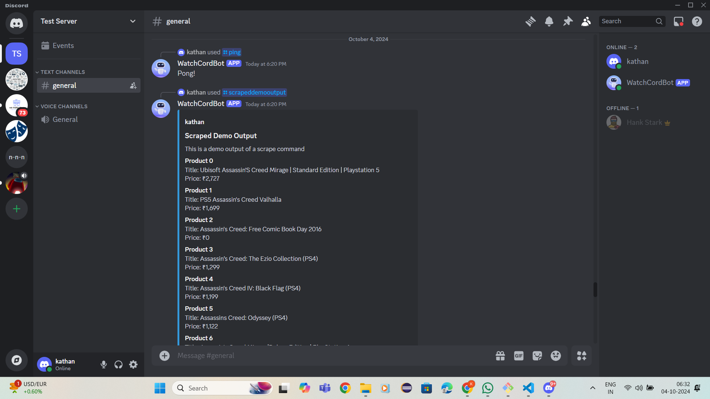
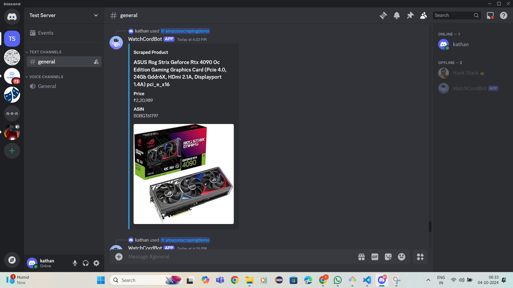
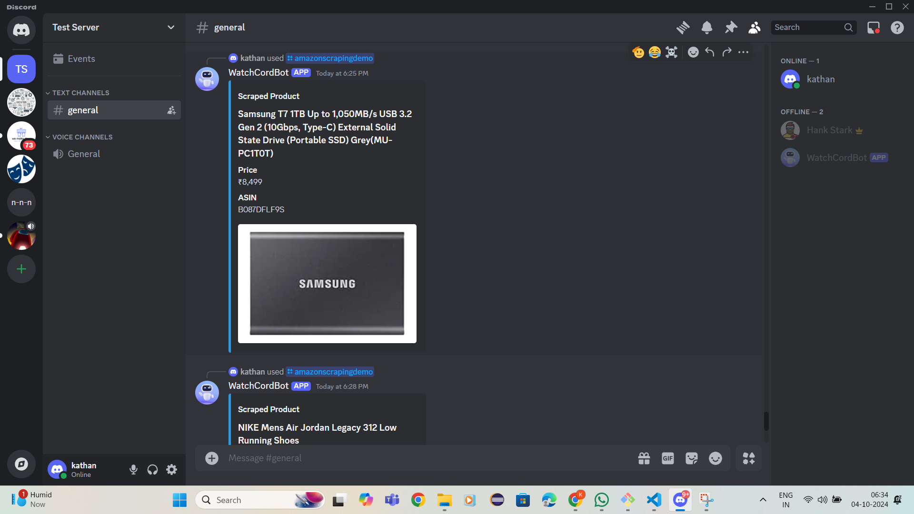
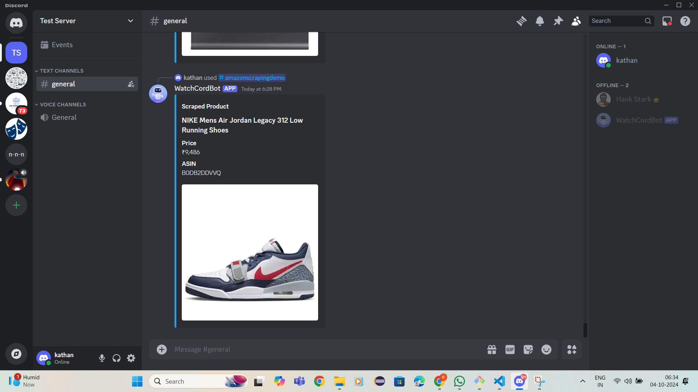

# WatchCord

**WatchCord** is a Discord bot project **under development**, designed to track product prices through web scraping and platform-specific/third-party APIs. Users can set target prices and receive automated pings by username or role when deals are found. Key features include real-time access to product details, scheduled tracking, search and filter commands, data logging for bot enhancement, automation scripts, and a GUI-based admin panel for ease of use.


## Screenshots

<!--  -->
<p float="left" align="middle">
  
  
</p>

<p float="left" align="middle">
  
  
</p>


## Environment Variables

To run this project, you will need to add the following environment variables to your .env file

`APP_ID`

`DISCORD_TOKEN`

`PUBLIC_KEY`


## Run Locally

Clone the project

```bash
git clone https://github.com/KathanJani/watchcord.git
```

Go to the project directory

```bash
cd watchcord
```

Create & activate a virtual environment

```bash
pip install venv

python -m venv .venv
  
.venv\Scripts\activate.bat
```

Install dependencies

```bash
pip install -r requirements.txt
```

Start the bot by running the script

```bash
bot.py
```


## Tech Stack

<div align="center">
  
  
  
  
  
  
  
  
  
  
  
  
  
  
  
  
  
  
  
  
  
  
  
  
  
</div>

###